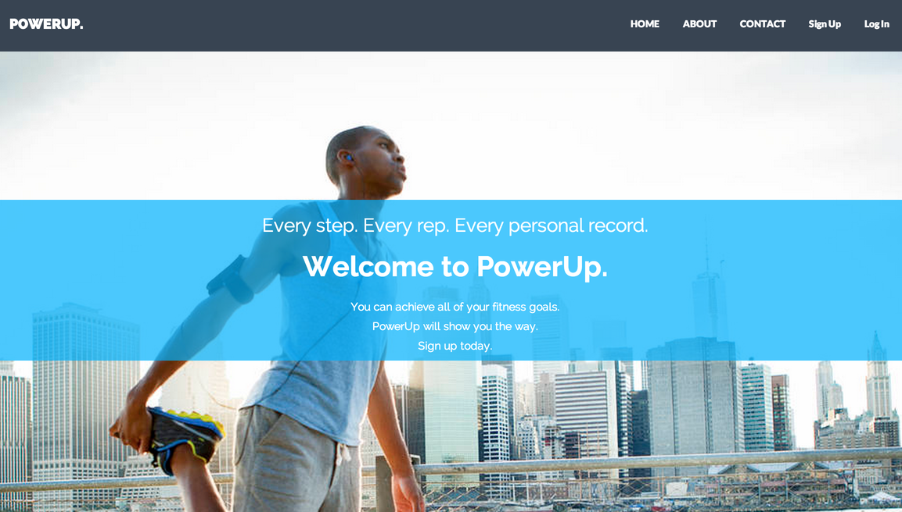
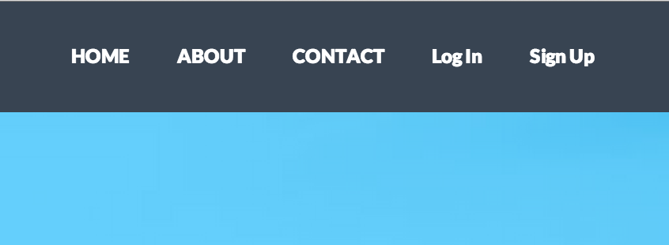
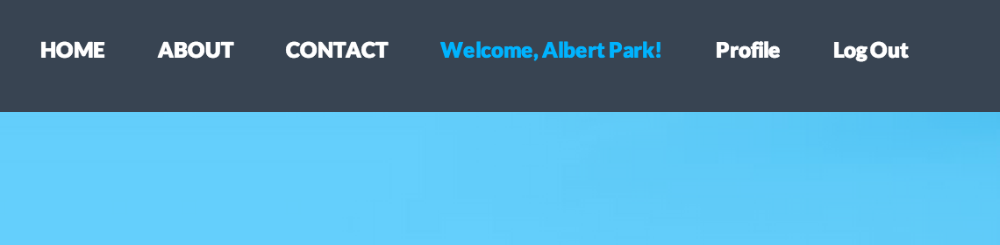

Ruby on Rails là một framework giúp cho các developers xây dựng hệ thống database phía back-end cho web-app của họ một cách nhanh chóng. Một trong những lý do khiến tôi thích ở Rails chính là khả năng hiển thị những thông tin back-end một cách dễ dàng. Chúng ta sẽ bắt đầu thực hiện việc này theo cách của Rails. Những phần thông tin được hiển thị ta sẽ gọi là "views", và hầu hết những phần này được viết bằng HTML và một chút Ruby. Rails cho chúng ta sử dụng ngôn ngữ Ruby để tăng thêm sự linh hoạt trong việc hiển thị views.



PowerUp là một ứng dụng cho phép người dùng lưu lại quá trình workout của họ (logging). Phần "views" của ứng dụng PowerUp cần phải đáp ứng các chức năng như sau:

+ Tạo tài khoản mới qua một form đăng ký
+ Đăng nhập tài khoản vào ứng dụng
+ Chỉnh sửa thông tin cá nhân
+ Tạo một workout log mới
+ Chỉnh sửa chi tiết một workout log nào đó.
+ Xóa một workout từ danh sách workout của người dùng

Để cho các views của chúng ta hiển thị một cách chính xác trên trình duyệt thì các dòng code HTML cần phải được format một cách đúng đắn. Rails sẽ giải quyết cho chúng ta về vấn đề này bằng một thứ gọi là "default page layout", đây là cách để sắp xếp các views của chúng ta trong app. Mặc định file này sẽ nằm trong đường dẫn `/app_name/app/views/layouts/application.html.erb`:

```html
<!DOCTYPE html>  
    <html>
        <head>
            <title>PowerUp</title>
            <%= stylesheet_link_tag    'application', media: 'all', 'data-turbolinks-track' => true %>
            <%= javascript_include_tag 'application', 'data-turbolinks-track' => true %>
            <%= csrf_meta_tags %>
        </head>
        <body>
            <%= yield %>
        </body>    
    </html>
```

File `application.html.erb` này sẽ cung cấp cho chúng ta tất cả các tag cơ bản như doctype, html, head, body mà không cần chúng ta tùy chỉnh thêm gì cả. Đây là một trong những lợi ích trong việc phát triển app với Rails. Trong file này, `<%= yield %>` tag được gọi là một dấu trang (placeholder). Rails sẽ bỏ tất cả các view cần thiết vào thay thế chỗ đó. Ví dụ, nếu views của chúng ta có các dòng code sau:

```html
<h1>This is an example page</h1>  
<p>I'll show up in place of the yield tag, just watch</p>  
```

Trình duyệt sẽ hiển thị như sau:

```html
<!DOCTYPE html>  
    <html>
        <head>
          <title>PowerUp</title>
          <%= stylesheet_link_tag 'application', media: 'all', 'data-turbolinks-track' => true %>
          <%= javascript_include_tag 'application', 'data-turbolinks-track' => true %>
          <%= csrf_meta_tags %>

        </head>
        <body>

            <h1>This is an example page</h1>
            <p>I show up in place of the yield tag, just watch</p>

        </body>
    </html>
```

Đây là một ví dụ cơ bản nhất trong việc Rails giúp giữ cho code của chúng ta được "DRY" (Don't Repeat Yourself). yield tag sẽ chỉ chèn vào những gì thật sự thay đổi trong file HTML, điều này sẽ giúp chúng ta không cần phải viết lại những cái tag lặp lại từ trang này qua trang khác.

Một công cụ khác giúp cho các developer viết code được "DRY" hơn chính là "partials". Các bạn có thể xem "partials" như là một đoạn code, có thể được gọi lại nhiều lần ở bất kỳ chỗ nào trong ứng dụng của chúng ta khi cần thiết. Trong PowerUp, các form được dùng cho việc tạo một workout log mới hay chỉnh sửa một log cũ thì đều giống nhau. Do đó để tránh việc tạo lại phần form này chúng ta sẽ sử dụng partial. Để sử dụng partial, chúng ta chỉ việc tạo một file mới và lưu nó lại với tên là `_form.html.erb` trong thư mục `views/workouts`

Sau đó, chúng ta có thể gọi nó ở trong file new workout, thêm một chút style với Bootstrap:

```html
<div class="col-sm-4 col-sm-offset-4">  
    <h1>Edit</h1>
    <%= render "workouts/form" %>
</div>  
```

Hãy để ý đến cách mà hàm render sử dụng `form` partial từ thư mục `workouts`. Việc chúng ta lưu file partial ở đâu khá quan trọng. Vì có thể trong tương lai, chúng ta sẽ tạo thêm nhiều form partial cho các mục khác chứ không riêng gì `workouts`, do đó, chúng ta cần phải chỉ rõ thư mục chứa partial mà chúng ta cần sử dụng.

Việc giữ cho code "DRY" hơn khá là tuyệt vời, nhưng nếu như chúng ta cũng muốn code chúng ta thông minh hơn thì phải làm thế nào? Giả sử như tôi muồn cung cấp cho người dùng đường dẫn đến trang profile của họ và cả chức năng đăng xuất, nhưng chỉ khi họ đã đăng nhập? Rails cho phép chúng ta làm điều đó một cách cực kì dễ dàng bằng cách chèn thêm các dòng code Ruby vào phần "views" của chúng ta.

Đầu tiên là thanh navbar với các link khi người dùng chưa đăng nhập



Đây là phần code views cho hình trên

```html
<li><%= link_to "Log In", new_session_path %></li>  
<li><%= link_to "Sign Up", new_user_path %></li>  
```

Khi người dùng chưa đăng nhập thì có vẻ đoạn code trên đã hoàn thành nhiệm vụ, tuy nhiên những links này sẽ không có ích gì khi người dùng đã đăng nhập vào hệ thống. Khi họ đã đăng nhập, chúng ta muốn người dùng có thể truy cập vào các link như sau:



Với việc Rails cho phép chúng ta chèn những đoạn code Ruby vào phần "views" thì có lẽ công việc này quá đễ dàng. Chúng ta chỉ cần thêm những đoạn if-else đơn giản để kiểm tra xem người dùng có đang đăng nhập hay không và đưa ra đường link thích hợp cho họ.

```html
<% if logged_in? %>  
        <li class="active"><%= link_to "Welcome, #{current_user.name}!", user_path(current_user) %> </li>
        <li><%= link_to "Profile", user_path(current_user) %> </li>
        <li><%= link_to 'Log Out', logout_path, method: :delete %></li>
    <% else %>
        <li><%= link_to "Log In", new_session_path %></li>
        <li><%= link_to "Sign Up", new_user_path %></li>
<% end %>  
```

Bây giờ, các đường link trên navbar của chúng ta sẽ thay đổi dựa theo trạng thái của user. Chúng ta có thể ứng dụng việc này vào rất nhiều tình huống như là đưa ra các thông báo lỗi, đếm các lượt vote/comment, cũng như cung cấp các chức năng khác nhau tùy theo loại tài khoản.

Nhờ có Rails, công việc của developers đã dễ thở hơn rất nhiều. Yield tag, partials, và việc chèn code Ruby trực tiếp vào phần views là những công cụ cơ bản giúp cho các developer có thể xây dựng được các "Views" hữu ích và hấp dẫn hơn cho ứng dụng của mình. Các bạn hãy thử áp dụng những kỹ thuật này vào app kế tiếp thử xem nhé.
